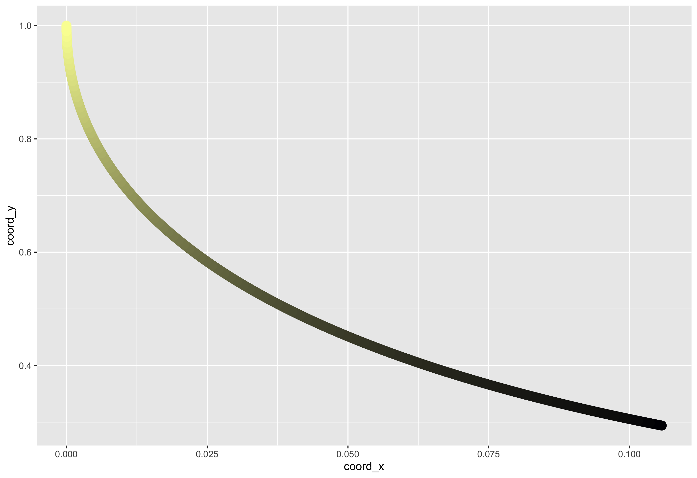

place\_grow\_plot
================
Emily Palmer
11/5/2020

## Take three core functions, and try to edit them for my purposes

First of all, I will try to grow the “saplings” at random locations on
the plot. Later I will want to have more than 1 tree on the plot.

I will dig in to three of the core functions `grow_sampling()`,
`shape_tree()` and `flame_tree_plot()`, and see if editing them will do
much good.



(Is there a `here()` call for paths in markdown?)

Hmm not a tree, and not what I was expecting.

Things I tried: - remove the `geom_bezier2` call and `palletteer` -
added back `palletteer` - playing with range for initial placement

``` r
#plot 1 seedling
stalk() %>% 
  arborist_call() %>%
  ggplot(aes(x = coord_x,
             y= coord_y, 
             group= id_path),
         color = "black")+
             #size = seg_wid, 
             #color = seg_col) + 
  geom_path() + 
  xlim(c(0,100)) + ylim(c(0,100)) + 
  theme_void() + theme(legend.position = "none")
  
# plot many seedling
plant_forest(ntrees = 50) %>% 
  arborist_call() %>%
  ggplot(aes(x = coord_x,
             y= coord_y, 
             group= id_path),
         color = "green")+
             #size = seg_wid, 
             #color = seg_col) + 
  geom_path() + 
  xlim(c(0,100)) + ylim(c(0,100)) + 
  theme_void() + theme(legend.position = "none")

#  plot_trees()

filename <- here::here("results",
                       paste0("tree",now(),".png"))
ggsave(filename)
```

### My first forest:


