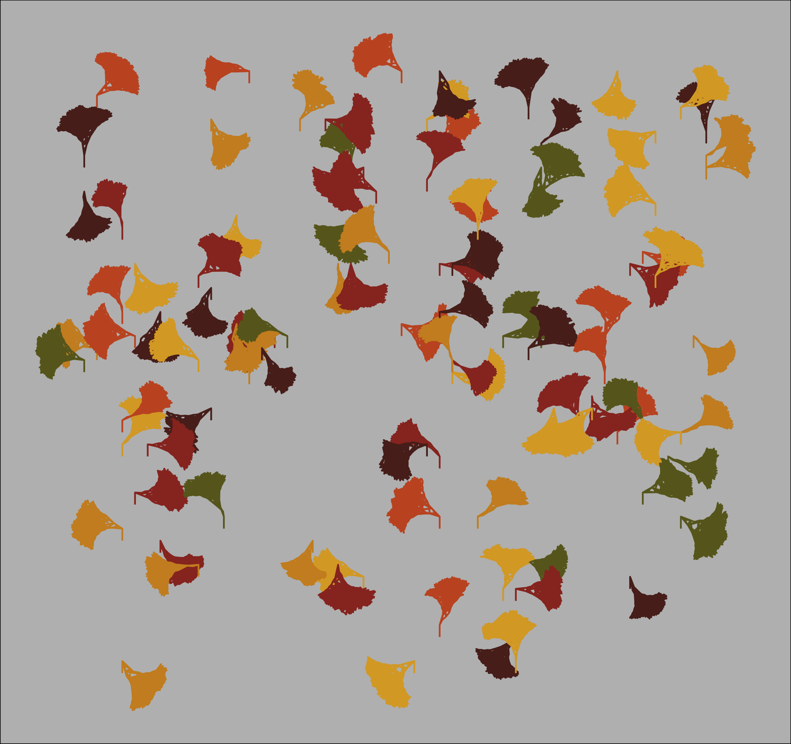

```{r setup, include=FALSE}
knitr::opts_chunk$set(echo = TRUE)
library(tidyverse)
devtools::load_all()
```


```{r, eval = FALSE}
param <- list(
    seed = 286,    # seed for the RNG
    time = 6,    # time (iterations) to grow the tree
    scale = c(.8,.9),  # possible values for rescaling at each time
    angle = c(-10,10,20),  # possible values for redirect at each time
    split = 3,  # number of new shoots from each old shoot at each time
    prune = 0  # probability of immediately pruning a new shoot
  )


# Test out some different fall palletes 
pal1 <- c( "#D1CEC5", "#997C67", "#755330", "#B0703C", "#DBA72E", "#E3CCA1")
pal2 <- c("#686724","#CD8E27","#C65729","#993327","#592821","#DBA72E")

forest <- make_the_leaves_fall(nleaves = 100,param = param)


gingko_plot <- forest %>%
  ggplot(aes(x = coord_x,
             y= coord_y, 
             group= leaf_id,
             color = factor(color))) + 
  geom_path(size = 1.5) + theme_void() +
  theme(legend.position = "none",
        plot.background = element_rect(fill = "gray74"))


gingko_plot + scale_color_manual(values = pal2) +
  coord_cartesian(xlim = c(0,10),ylim = c(0,10))

filename <- here::here("results",
                       paste0("gingko_plot",lubridate::now(),".png"))
ggsave(filename)

```





## Week 8 work 

```{r}

param <- list(
    seed = 286,    # seed for the RNG
    time = 6,    # time (iterations) to grow the tree
    scale = c(.8,.9),  # possible values for rescaling at each time
    angle = c(-10,10,20),  # possible values for redirect at each time
    split = 3,  # number of new shoots from each old shoot at each time
    prune = 0  # probability of immediately pruning a new shoot
  )


initialize() %>% 
  full_leaf(param = param) %>% 
  rake_leaves() %>%
  ggplot(aes(x = x,y= y,color = factor(color))) + 
    geom_path(size = 1)


```


```{r}
df <- data.frame(x = c(0,3,4,3,0), y = c(0,2,4,1,0))

df %>% 
  ggplot(aes(x = x, y = y)) + 
  geom_path()+ 
  xlim(-5,5) + ylim(-5,5)

df <- df %>% 
  mutate(x =  x*cos(pi/4) - y*sin(pi/4),
         y =  y*cos(pi/4) + x*sin(pi/4))
df %>% 
  ggplot(aes(x = x, y = y)) + 
  geom_path() + 
  xlim(-5,5) + ylim(-5,5)
```

