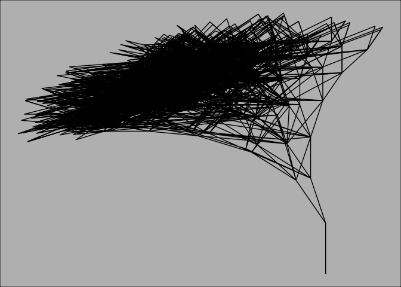
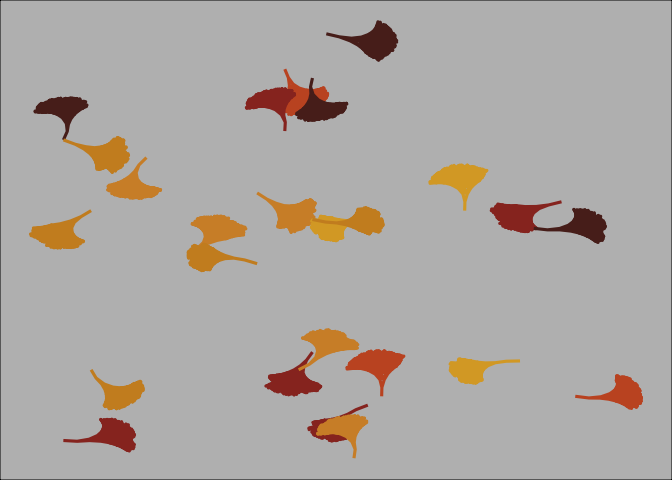
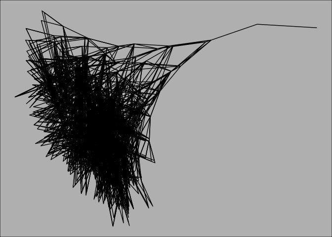
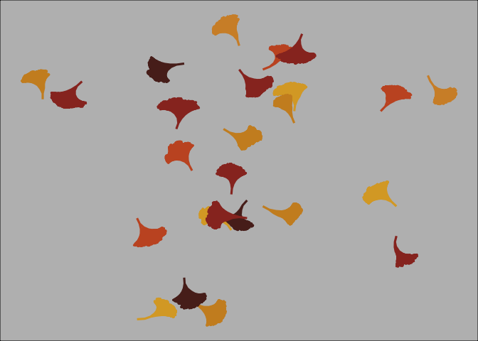

Week 9
================
Emily Palmer
11/23/2020

## Test functions are working

### Test the movable leaves work

``` r
param <- get_ginkgo_params(init_location = "origin")

# One leaf
get_ginkgo_params(init_location = "origin") %>% 
  grow_leaf() %>% 
  rake_leaves() %>% 
  plot_leaves()
```

<!-- -->

``` r
# many leaves 
get_ginkgo_params(init_location = "origin") %>% 
  spread_leaves() %>% 
  plot_leaves()
```

<!-- -->

### Test the initially randomly placed and rotated leaves work

``` r
# one leaf
param <- get_ginkgo_params(init_location = "random")

get_ginkgo_params(init_location = "random") %>%
  grow_leaf() %>% 
  rake_leaves() %>%
  plot_leaves()
```

<!-- -->

``` r
# multiple leaves
get_ginkgo_params() %>% 
  create_leaf_pile() %>% 
  plot_leaves()
```

<!-- -->

``` r
initialize <- tibble(
    # Choose a random first location, smaller selection for leafs falling
    x_0 = sample(1:50,1),
    y_0 = sample(1:50,1),
    x_1 = x_0,
    y_1 = y_0 + 1,
    angle = sample(-180:180,1), # Random orientation of leaf orientation
    length = 1,       # initial
    iter_n = 1L       # time used for
  )
grow_leaf_layers(initialize, param)
```

    ## # A tibble: 3 x 7
    ##     x_0   y_0   x_1   y_1 angle length iter_n
    ##   <int> <dbl> <dbl> <dbl> <dbl>  <dbl>  <int>
    ## 1    42     8  41.4  8.54   138    0.8      2
    ## 2    42     8  41.5  8.63   128    0.8      2
    ## 3    42     8  41.3  8.60   138    0.9      2

``` r
one_branch(partial_leaf = initialize, param = param)
```

    ## # A tibble: 1 x 7
    ##     x_0   y_0   x_1   y_1 angle length iter_n
    ##   <int> <dbl> <dbl> <dbl> <dbl>  <dbl>  <int>
    ## 1    42     8  41.7  8.86   108    0.9      2

``` r
leaf <- get_ginkgo_params() %>%
  grow_leaf()
```
